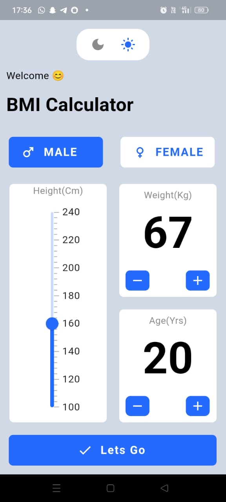
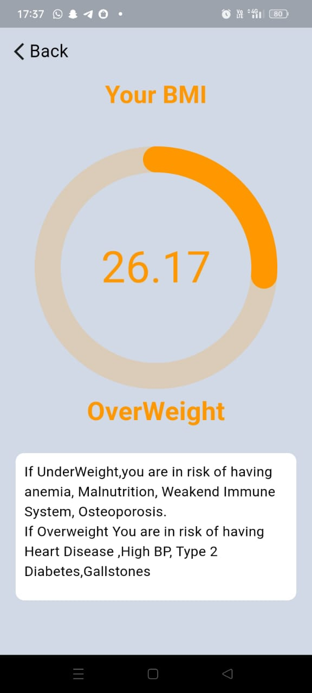

# FitCheck+: Smart BMI Tracker

## Overview

FitCheck+ is an Android application designed to help users calculate their Body Mass Index (BMI) and track their weight and height for better health management. The user-friendly interface ensures ease of use and a seamless experience.

## Features

✅ Calculate BMI based on height and weight
✅ Get recommendations based on BMI results
✅ Supports both Light and Dark mode
✅ Simple, intuitive, and user-friendly interface

### Home Screen

  
  

### Result Screen

  
  

## Getting Started

1. Clone the repository
2. Run `flutter pub get` to install dependencies
3. Run `flutter run` to start the app

