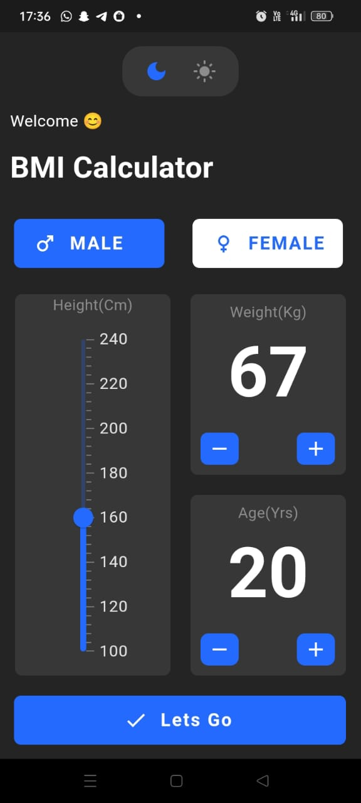
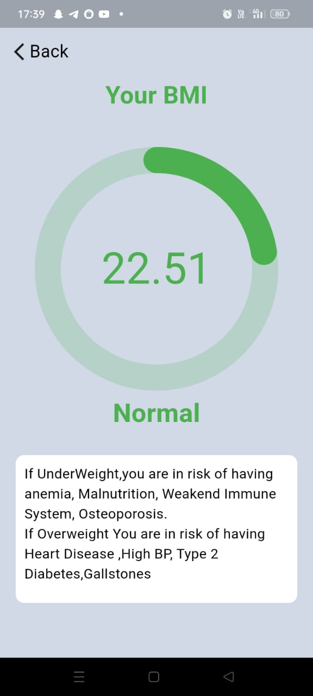

# FitCheck+: Smart BMI Tracker

## Overview

FitCheck+ is an Android application designed to help users calculate their Body Mass Index (BMI) and track their weight and height for better health management. The user-friendly interface ensures ease of use and a seamless experience.

## Features

✅ Calculate BMI based on height and weight
✅ Get recommendations based on BMI results
✅ Supports both Light and Dark mode
✅ Simple, intuitive, and user-friendly interface

### Home Screen

<div style="display: flex; justify-content: space-around;">
  
  
</div>

### Result Screen

<div style="display: flex; justify-content: space-around;">
  
  
</div>

## Technolgies Used

 **Flutter**: Framework for building the cross-platform app.
- **Dart**: Programming language used with Flutter.
- **Get (^4.6.6)**: State management and navigation package.
- **Syncfusion Flutter Sliders (^24.2.9)**: For the slider UI component.
- **Percent Indicator (^4.2.3)**: For displaying progress or percentage indicators.

## Installation & Setup

1. **Clone the repository**:

   ```bash
   git clone https://github.com/Lord-Alpha-dark/Fit-Check-Smart-BMI-Tracker.git

1. **Install dependencies**:

   ```bash
    flutter pub get

1. **Run the App**:

   ```bash
   flutter run


